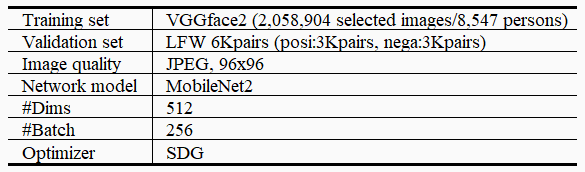

# L2-constrained Softmax Loss for Face Verification
Train and validate VGGface2 dataset based on L2-constrained softmax loss.

# Training with VGGface2

# The Final Results
LFW : max 97%  
VGG Validation Set *1 : max 97%  
VGG Softmax Classification *2 : max 99%  
Trained by python_trainVGG_softmax_PyTorch.py  
*1 Fixed 10,000 pairs in the training set    
*2 1,024 samples randomly selected every step from the training set  

