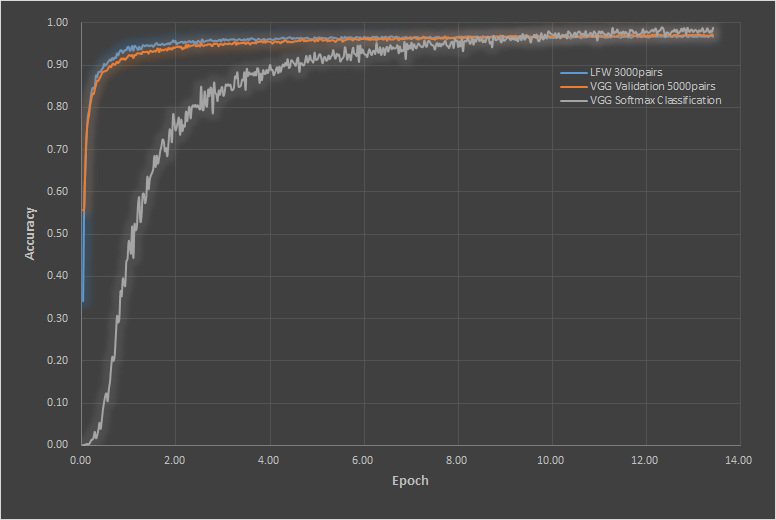

# L2-constrained Softmax Loss for Face Recognition
Train and validate VGGface2 dataset based on L2-constrained softmax loss.

# Final Results

LFW : max 97%  
VGG Validation Set : max 97%  
VGG Softmax Classification : max 99%  
Trained by python_trainVGG_softmax_PyTorch.py

